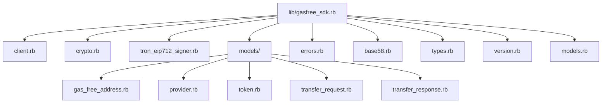

# Структура проекта и зависимости кода
_Exported on 15.07.2025 at 0:08:00 GMT+3 from Cursor (1.2.4)_

---

**User**

- где какие части кода находятся
- за что эти части кода отвечают
- какие есть ключевые зависимости и структура проекта

---

**Cursor**

Вот обзор структуры вашего проекта gasfree_sdk, с пояснениями по основным частям, их назначению и ключевым зависимостям:

## 1. Структура проекта и назначение папок/файлов

```plaintext
gasfree_sdk/
│
├── bin/                # Скрипты для запуска из консоли (например, setup, console)
│
├── examples/           # Примеры использования библиотеки
│
├── lib/
│   └── gasfree_sdk/    # Основной исходный код библиотеки
│       ├── base58.rb               # Работа с Base58 (кодирование/декодирование)
│       ├── client.rb               # Основной клиент для взаимодействия с API/сервисом
│       ├── crypto.rb               # Криптографические функции
│       ├── errors.rb               # Определения ошибок/исключений
│       ├── models/                 # Модели данных (структуры для адресов, токенов и т.д.)
│       │   ├── gas_free_address.rb
│       │   ├── provider.rb
│       │   ├── token.rb
│       │   ├── transfer_request.rb
│       │   ├── transfer_response.rb
│       ├── models.rb               # Подключение/экспорт моделей
│       ├── tron_eip712_signer.rb   # Подпись транзакций Tron по стандарту EIP-712
│       ├── types.rb                # Типы данных (возможно, алиасы или структуры)
│       ├── version.rb              # Версия библиотеки
│   └── gasfree_sdk.rb              # Точка входа, подключает все части библиотеки
│
├── sig/
│   └── gasfree_sdk.rbs             # RBS-описания типов для статической проверки
│
├── spec/                           # Тесты (RSpec)
│   ├── fixtures/                   # Фикстуры для тестов (например, VCR-кассеты)
│   ├── gasfree_sdk/                # Тесты для отдельных частей библиотеки
│   ├── gasfree_sdk_spec.rb         # Общие тесты
│   └── spec_helper.rb              # Конфигурация тестов
│
├── Gemfile, Gemfile.lock           # Зависимости проекта
├── gasfree_sdk.gemspec             # Описание гемa (имя, версия, зависимости и т.д.)
├── README.md                       # Документация
├── LICENSE.txt                     # Лицензия
├── Rakefile                        # Задачи Rake (например, запуск тестов)
└── CHANGELOG.md                    # История изменений
```

## 2. За что отвечают основные части

- **lib/gasfree_sdk/** — вся бизнес-логика SDK:
  - **client.rb** — основной интерфейс для пользователя библиотеки, через него идут запросы к API или сервису.
  - **crypto.rb** — криптографические операции (например, подпись, хэширование).
  - **tron_eip712_signer.rb** — реализация подписи транзакций Tron по стандарту EIP-712.
  - **models/** — структуры данных, которые используются для передачи информации (например, адреса, токены, запросы/ответы на перевод).
  - **errors.rb** — определяет собственные классы ошибок для SDK.
  - **base58.rb** — вспомогательные функции для кодирования/декодирования Base58.
  - **types.rb** — определяет типы данных, возможно, для типизации или валидации.
  - **version.rb** — версия библиотеки.
- **lib/gasfree_sdk.rb** — точка входа, подключает все необходимые файлы.
- **sig/** — типовые описания для статической проверки типов (RBS).
- **examples/** — примеры использования SDK.
- **spec/** — тесты, покрывающие функционал библиотеки.
- **bin/** — вспомогательные скрипты для разработчиков или пользователей.

## 3. Ключевые зависимости

- **Gemfile/Gemfile.lock** — здесь указаны все Ruby-гемы, от которых зависит проект (например, RSpec для тестирования, возможно, гемы для работы с криптографией, HTTP-клиенты и т.д.).
- **gasfree_sdk.gemspec** — определяет зависимости, которые нужны для работы самого гема (например, минимальная версия Ruby, runtime-зависимости).

## 4. Краткая схема (Mermaid)



## 5. Как начать разбираться

- Начните с файла `lib/gasfree_sdk.rb` — он подключает все остальные части.
- Посмотрите на `client.rb` — это основной интерфейс для пользователя.
- Изучите модели в `models/` — они определяют, какие данные используются.
- Ознакомьтесь с примерами в `examples/` для понимания типового использования.
- Посмотрите тесты в `spec/` для понимания ожидаемого поведения.

Если нужно подробнее по какому-то файлу или части — уточните, и я расскажу!

```plaintext
gasfree_sdk/
│
├── bin/                # Скрипты для запуска из консоли (например, setup, console)
│
├── examples/           # Примеры использования библиотеки
│
├── lib/
│   └── gasfree_sdk/    # Основной исходный код библиотеки
│       ├── base58.rb               # Работа с Base58 (кодирование/декодирование)
│       ├── client.rb               # Основной клиент для взаимодействия с API/сервисом
│       ├── crypto.rb               # Криптографические функции
│       ├── errors.rb               # Определения ошибок/исключений
│       ├── models/                 # Модели данных (структуры для адресов, токенов и т.д.)
│       │   ├── gas_free_address.rb
│       │   ├── provider.rb
│       │   ├── token.rb
│       │   ├── transfer_request.rb
│       │   ├── transfer_response.rb
│       ├── models.rb               # Подключение/экспорт моделей
│       ├── tron_eip712_signer.rb   # Подпись транзакций Tron по стандарту EIP-712
│       ├── types.rb                # Типы данных (возможно, алиасы или структуры)
│       ├── version.rb              # Версия библиотеки
│   └── gasfree_sdk.rb              # Точка входа, подключает все части библиотеки
│
├── sig/
│   └── gasfree_sdk.rbs             # RBS-описания типов для статической проверки
│
├── spec/                           # Тесты (RSpec)
│   ├── fixtures/                   # Фикстуры для тестов (например, VCR-кассеты)
│   ├── gasfree_sdk/                # Тесты для отдельных частей библиотеки
│   ├── gasfree_sdk_spec.rb         # Общие тесты
│   └── spec_helper.rb              # Конфигурация тестов
│
├── Gemfile, Gemfile.lock           # Зависимости проекта
├── gasfree_sdk.gemspec             # Описание гемa (имя, версия, зависимости и т.д.)
├── README.md                       # Документация
├── LICENSE.txt                     # Лицензия
├── Rakefile                        # Задачи Rake (например, запуск тестов)
└── CHANGELOG.md                    # История изменений
```

```plaintext
graph TD
  A[lib/gasfree_sdk.rb] --> B[client.rb]
  A --> C[crypto.rb]
  A --> D[tron_eip712_signer.rb]
  A --> E[models/]
  E --> E1[gas_free_address.rb]
  E --> E2[provider.rb]
  E --> E3[token.rb]
  E --> E4[transfer_request.rb]
  E --> E5[transfer_response.rb]
  A --> F[errors.rb]
  A --> G[base58.rb]
  A --> H[types.rb]
  A --> I[version.rb]
  A --> J[models.rb]
```

---

**User**

У нас есть issue:

response :logger may log private keys, secrets, or raw signatures when DEBUG_GASFREE_SDK is enabled.
Risk: Leakage of credentials to log files or monitoring systems.
Proposed fix: Mask or redact sensitive headers/fields in debugging middleware.

Сформулируй plan-of-action или decomposition — что нужно сделать, чтобы решить эту задачу.

---

**Cursor**

Вот подробный план действий (decomposition) для решения задачи по предотвращению утечки приватных ключей, секретов или raw-подписей в логах при включённом DEBUG_GASFREE_SDK:

---

## План действий по маскированию/редактированию чувствительных данных в логах

### 1. Анализ текущей реализации логирования

- Найти, где и как происходит логирование запросов/ответов при включённом DEBUG_GASFREE_SDK.
- Определить, какие поля/заголовки/части данных могут содержать приватные ключи, секреты или подписи.

### 2. Составить список чувствительных полей

- Составить перечень всех потенциально опасных полей (например: `private_key`, `secret`, `signature`, `raw_signature`, `Authorization`, и т.д.).
- Убедиться, что список покрывает все возможные места утечки.

### 3. Разработать функцию маскирования/редактирования

- Реализовать функцию, которая будет проходить по структуре данных (хэш, массив, строка) и заменять значения чувствительных полей на маску (например, `***REDACTED***`).
- Убедиться, что функция работает рекурсивно для вложенных структур.

### 4. Интеграция маскирования в middleware/логгер

- Внедрить вызов функции маскирования непосредственно перед логированием данных.
- Убедиться, что в DEBUG-режиме в лог попадают только отредактированные данные.

### 5. Покрытие тестами

- Добавить/обновить тесты, чтобы убедиться, что чувствительные данные не попадают в логи.
- Проверить, что обычные (нечувствительные) данные продолжают логироваться корректно.

### 6. Документация и ревью

- Обновить документацию (если требуется), описав, что чувствительные данные теперь маскируются.
- Провести код-ревью и убедиться, что не осталось мест, где данные могут утечь.

---

## Пример decomposition в виде списка задач

1. Найти все места логирования запросов/ответов (особенно при DEBUG_GASFREE_SDK).
2. Составить список чувствительных полей для маскирования.
3. Реализовать универсальную функцию маскирования чувствительных данных.
4. Внедрить маскирование в middleware/логгер.
5. Добавить/обновить тесты для проверки отсутствия утечки.
6. Обновить документацию (при необходимости).
7. Провести ревью и убедиться в отсутствии утечек.

---

Если нужно, могу расписать примерную сигнатуру функции маскирования или предложить шаблон для тестов!

