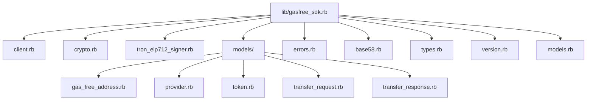

# Структура проекта и зависимости кода
_Exported on 15.07.2025 at 0:33:52 GMT+3 from Cursor (1.2.4)_

---

**User**

- где какие части кода находятся
- за что эти части кода отвечают
- какие есть ключевые зависимости и структура проекта

---

**Cursor**

Вот обзор структуры вашего проекта gasfree_sdk, с пояснениями по основным частям, их назначению и ключевым зависимостям:

## 1. Структура проекта и назначение папок/файлов

```plaintext
gasfree_sdk/
│
├── bin/                # Скрипты для запуска из консоли (например, setup, console)
│
├── examples/           # Примеры использования библиотеки
│
├── lib/
│   └── gasfree_sdk/    # Основной исходный код библиотеки
│       ├── base58.rb               # Работа с Base58 (кодирование/декодирование)
│       ├── client.rb               # Основной клиент для взаимодействия с API/сервисом
│       ├── crypto.rb               # Криптографические функции
│       ├── errors.rb               # Определения ошибок/исключений
│       ├── models/                 # Модели данных (структуры для адресов, токенов и т.д.)
│       │   ├── gas_free_address.rb
│       │   ├── provider.rb
│       │   ├── token.rb
│       │   ├── transfer_request.rb
│       │   ├── transfer_response.rb
│       ├── models.rb               # Подключение/экспорт моделей
│       ├── tron_eip712_signer.rb   # Подпись транзакций Tron по стандарту EIP-712
│       ├── types.rb                # Типы данных (возможно, алиасы или структуры)
│       ├── version.rb              # Версия библиотеки
│   └── gasfree_sdk.rb              # Точка входа, подключает все части библиотеки
│
├── sig/
│   └── gasfree_sdk.rbs             # RBS-описания типов для статической проверки
│
├── spec/                           # Тесты (RSpec)
│   ├── fixtures/                   # Фикстуры для тестов (например, VCR-кассеты)
│   ├── gasfree_sdk/                # Тесты для отдельных частей библиотеки
│   ├── gasfree_sdk_spec.rb         # Общие тесты
│   └── spec_helper.rb              # Конфигурация тестов
│
├── Gemfile, Gemfile.lock           # Зависимости проекта
├── gasfree_sdk.gemspec             # Описание гемa (имя, версия, зависимости и т.д.)
├── README.md                       # Документация
├── LICENSE.txt                     # Лицензия
├── Rakefile                        # Задачи Rake (например, запуск тестов)
└── CHANGELOG.md                    # История изменений
```

## 2. За что отвечают основные части

- **lib/gasfree_sdk/** — вся бизнес-логика SDK:
  - **client.rb** — основной интерфейс для пользователя библиотеки, через него идут запросы к API или сервису.
  - **crypto.rb** — криптографические операции (например, подпись, хэширование).
  - **tron_eip712_signer.rb** — реализация подписи транзакций Tron по стандарту EIP-712.
  - **models/** — структуры данных, которые используются для передачи информации (например, адреса, токены, запросы/ответы на перевод).
  - **errors.rb** — определяет собственные классы ошибок для SDK.
  - **base58.rb** — вспомогательные функции для кодирования/декодирования Base58.
  - **types.rb** — определяет типы данных, возможно, для типизации или валидации.
  - **version.rb** — версия библиотеки.
- **lib/gasfree_sdk.rb** — точка входа, подключает все необходимые файлы.
- **sig/** — типовые описания для статической проверки типов (RBS).
- **examples/** — примеры использования SDK.
- **spec/** — тесты, покрывающие функционал библиотеки.
- **bin/** — вспомогательные скрипты для разработчиков или пользователей.

## 3. Ключевые зависимости

- **Gemfile/Gemfile.lock** — здесь указаны все Ruby-гемы, от которых зависит проект (например, RSpec для тестирования, возможно, гемы для работы с криптографией, HTTP-клиенты и т.д.).
- **gasfree_sdk.gemspec** — определяет зависимости, которые нужны для работы самого гема (например, минимальная версия Ruby, runtime-зависимости).

## 4. Краткая схема (Mermaid)



## 5. Как начать разбираться

- Начните с файла `lib/gasfree_sdk.rb` — он подключает все остальные части.
- Посмотрите на `client.rb` — это основной интерфейс для пользователя.
- Изучите модели в `models/` — они определяют, какие данные используются.
- Ознакомьтесь с примерами в `examples/` для понимания типового использования.
- Посмотрите тесты в `spec/` для понимания ожидаемого поведения.

Если нужно подробнее по какому-то файлу или части — уточните, и я расскажу!

```plaintext
gasfree_sdk/
│
├── bin/                # Скрипты для запуска из консоли (например, setup, console)
│
├── examples/           # Примеры использования библиотеки
│
├── lib/
│   └── gasfree_sdk/    # Основной исходный код библиотеки
│       ├── base58.rb               # Работа с Base58 (кодирование/декодирование)
│       ├── client.rb               # Основной клиент для взаимодействия с API/сервисом
│       ├── crypto.rb               # Криптографические функции
│       ├── errors.rb               # Определения ошибок/исключений
│       ├── models/                 # Модели данных (структуры для адресов, токенов и т.д.)
│       │   ├── gas_free_address.rb
│       │   ├── provider.rb
│       │   ├── token.rb
│       │   ├── transfer_request.rb
│       │   ├── transfer_response.rb
│       ├── models.rb               # Подключение/экспорт моделей
│       ├── tron_eip712_signer.rb   # Подпись транзакций Tron по стандарту EIP-712
│       ├── types.rb                # Типы данных (возможно, алиасы или структуры)
│       ├── version.rb              # Версия библиотеки
│   └── gasfree_sdk.rb              # Точка входа, подключает все части библиотеки
│
├── sig/
│   └── gasfree_sdk.rbs             # RBS-описания типов для статической проверки
│
├── spec/                           # Тесты (RSpec)
│   ├── fixtures/                   # Фикстуры для тестов (например, VCR-кассеты)
│   ├── gasfree_sdk/                # Тесты для отдельных частей библиотеки
│   ├── gasfree_sdk_spec.rb         # Общие тесты
│   └── spec_helper.rb              # Конфигурация тестов
│
├── Gemfile, Gemfile.lock           # Зависимости проекта
├── gasfree_sdk.gemspec             # Описание гемa (имя, версия, зависимости и т.д.)
├── README.md                       # Документация
├── LICENSE.txt                     # Лицензия
├── Rakefile                        # Задачи Rake (например, запуск тестов)
└── CHANGELOG.md                    # История изменений
```

```plaintext
graph TD
  A[lib/gasfree_sdk.rb] --> B[client.rb]
  A --> C[crypto.rb]
  A --> D[tron_eip712_signer.rb]
  A --> E[models/]
  E --> E1[gas_free_address.rb]
  E --> E2[provider.rb]
  E --> E3[token.rb]
  E --> E4[transfer_request.rb]
  E --> E5[transfer_response.rb]
  A --> F[errors.rb]
  A --> G[base58.rb]
  A --> H[types.rb]
  A --> I[version.rb]
  A --> J[models.rb]
```

---

**User**

У нас есть issue:

response :logger may log private keys, secrets, or raw signatures when DEBUG_GASFREE_SDK is enabled.
Risk: Leakage of credentials to log files or monitoring systems.
Proposed fix: Mask or redact sensitive headers/fields in debugging middleware.

Сформулируй plan-of-action или decomposition — что нужно сделать, чтобы решить эту задачу.

---

**Cursor**

Вот подробный план действий (decomposition) для решения задачи по предотвращению утечки приватных ключей, секретов или raw-подписей в логах при включённом DEBUG_GASFREE_SDK:

---

## План действий по маскированию/редактированию чувствительных данных в логах

### 1. Анализ текущей реализации логирования

- Найти, где и как происходит логирование запросов/ответов при включённом DEBUG_GASFREE_SDK.
- Определить, какие поля/заголовки/части данных могут содержать приватные ключи, секреты или подписи.

### 2. Составить список чувствительных полей

- Составить перечень всех потенциально опасных полей (например: `private_key`, `secret`, `signature`, `raw_signature`, `Authorization`, и т.д.).
- Убедиться, что список покрывает все возможные места утечки.

### 3. Разработать функцию маскирования/редактирования

- Реализовать функцию, которая будет проходить по структуре данных (хэш, массив, строка) и заменять значения чувствительных полей на маску (например, `***REDACTED***`).
- Убедиться, что функция работает рекурсивно для вложенных структур.

### 4. Интеграция маскирования в middleware/логгер

- Внедрить вызов функции маскирования непосредственно перед логированием данных.
- Убедиться, что в DEBUG-режиме в лог попадают только отредактированные данные.

### 5. Покрытие тестами

- Добавить/обновить тесты, чтобы убедиться, что чувствительные данные не попадают в логи.
- Проверить, что обычные (нечувствительные) данные продолжают логироваться корректно.

### 6. Документация и ревью

- Обновить документацию (если требуется), описав, что чувствительные данные теперь маскируются.
- Провести код-ревью и убедиться, что не осталось мест, где данные могут утечь.

---

## Пример decomposition в виде списка задач

1. Найти все места логирования запросов/ответов (особенно при DEBUG_GASFREE_SDK).
2. Составить список чувствительных полей для маскирования.
3. Реализовать универсальную функцию маскирования чувствительных данных.
4. Внедрить маскирование в middleware/логгер.
5. Добавить/обновить тесты для проверки отсутствия утечки.
6. Обновить документацию (при необходимости).
7. Провести ревью и убедиться в отсутствии утечек.

---

Если нужно, могу расписать примерную сигнатуру функции маскирования или предложить шаблон для тестов!

---

**User**

Есть проблемы, о которых нам стоит беспокоиться?

---

**Cursor**

Да, при решении этой задачи есть несколько потенциальных проблем и нюансов, о которых стоит помнить:

---

## 1. **Неполное покрытие чувствительных данных**
- **Риск:** Можно случайно пропустить новые или неочевидные поля, содержащие секреты (например, нестандартные имена, вложенные структуры, бинарные данные).
- **Что делать:**  
  - Регулярно обновлять список маскируемых полей.
  - Делать маскирование рекурсивным и универсальным.
  - Добавить возможность легко расширять список полей через конфиг.

## 2. **Маскирование только на верхнем уровне**
- **Риск:** Если функция маскирует только верхний уровень хэша, секреты во вложенных структурах могут попасть в лог.
- **Что делать:**  
  - Реализовать рекурсивное маскирование для всех вложенных структур.

## 3. **Логирование бинарных или сериализованных данных**
- **Риск:** Секреты могут быть закодированы в base64, hex или сериализованы, и не распознаваться по имени поля.
- **Что делать:**  
  - По возможности, избегать логирования "сырых" данных вообще.
  - Добавить эвристики для обнаружения подозрительных длинных строк (например, если строка похожа на приватный ключ или подпись).

## 4. **Снижение удобства отладки**
- **Риск:** Маскирование может затруднить отладку, если замаскированы важные для диагностики данные.
- **Что делать:**  
  - Маскировать только действительно чувствительные данные.
  - Оставлять часть значения (например, первые/последние 4 символа) для идентификации, если это безопасно.

## 5. **Производительность**
- **Риск:** Рекурсивное маскирование больших структур может замедлить логирование.
- **Что делать:**  
  - Оптимизировать функцию маскирования.
  - Не логировать слишком большие объёмы данных в DEBUG-режиме.

## 6. **Случайное логирование до маскирования**
- **Риск:** Где-то в коде может быть прямое логирование без маскирования.
- **Что делать:**  
  - Провести аудит всех мест логирования.
  - Ввести правило: все логи проходят через маскирующий фильтр.

## 7. **Тесты и CI**
- **Риск:** Тесты могут случайно "утекать" секреты в артефакты CI/CD.
- **Что делать:**  
  - Проверять тестовые логи на отсутствие секретов.
  - Добавить тесты, которые валидируют отсутствие утечек.

---

**Вывод:**  
Главная опасность — человеческий фактор и неполное покрытие. Важно сделать маскирование универсальным, легко расширяемым и обязательным для всех логов, а также регулярно проводить аудит и обновлять список чувствительных полей.

Если хотите, могу предложить чек-лист для аудита или пример теста на отсутствие утечек!

---

**User**

Хорошо. Давай приступим к реализации плана. Начнем с пункта 
1. Найти все места логирования запросов/ответов (особенно при DEBUG_GASFREE_SDK).

---

**Cursor**

### Результаты поиска мест логирования запросов/ответов

**1. Основное место логирования запросов и ответов:**
- В файле `lib/gasfree_sdk/client.rb`:
  ```ruby
  f.response :logger, ::Logger.new($stdout), bodies: true if ENV["DEBUG_GASFREE_SDK"]
  ```
  Это Faraday middleware, который логирует все HTTP-запросы и ответы, включая тела (bodies: true), если выставлена переменная окружения `DEBUG_GASFREE_SDK`.

**2. Глобальный логгер:**
- В файле `lib/gasfree_sdk.rb`:
  ```ruby
  setting :logger, default: Logger.new($stdout)
  ```
  Это глобальный логгер SDK, но он не используется для логирования HTTP-запросов/ответов напрямую — для этого используется Faraday middleware выше.

**3. Ручного логирования запросов/ответов (через info/debug/warn/error) не найдено.**
- В коде нет явных вызовов методов логирования для HTTP-запросов/ответов, только через Faraday middleware.

---

**Вывод:**  
Все логирование HTTP-запросов и ответов при отладке (`DEBUG_GASFREE_SDK`) происходит через Faraday middleware `:logger` в `Client`.  
Следующий шаг — реализовать middleware/фильтр для маскирования чувствительных данных до передачи их в логгер Faraday.

Готов двигаться к следующему пункту?

```ruby
  f.response :logger, ::Logger.new($stdout), bodies: true if ENV["DEBUG_GASFREE_SDK"]
```

```ruby
  setting :logger, default: Logger.new($stdout)
```

---

**User**

Отлично! переходим к пункту
2. Составить список чувствительных полей для маскирования.

---

**Cursor**

Вот рекомендуемый список чувствительных полей, которые нужно маскировать в логах для SDK, работающего с криптовалютами и API:

---

## Список чувствительных полей для маскирования

### 1. **Заголовки HTTP**
- `Authorization`
- `Api-Key`
- `ApiKey`
- `X-Api-Key`
- `X-API-KEY`
- `X-Access-Token`
- `Access-Token`
- `Token`
- `Secret`
- `X-Secret`
- `X-Api-Secret`

### 2. **Поля тела запроса/ответа**
- `private_key`
- `privateKey`
- `secret`
- `api_secret`
- `apiSecret`
- `signature`
- `sig`
- `raw_signature`
- `rawSignature`
- `password`
- `mnemonic`
- `seed`
- `auth_token`
- `authToken`
- `session_token`
- `sessionToken`
- `access_token`
- `accessToken`

### 3. **Возможные дополнительные поля**
- Любые поля, содержащие в имени: `key`, `secret`, `token`, `sig`, `pass`, `mnemonic`, `seed` (регистр не важен).

---

## Пример итогового списка (Ruby-массив)

```ruby
SENSITIVE_FIELDS = %w[
  authorization api-key apikey x-api-key x-access-token access-token token secret x-secret x-api-secret
  private_key privateKey api_secret apiSecret signature sig raw_signature rawSignature password mnemonic seed
  auth_token authToken session_token sessionToken access_token accessToken
]
```

## Рекомендации:
- Маскировать поля как в заголовках, так и в теле запроса/ответа.
- Проверять имена полей без учёта регистра.
- Для универсальности можно добавить эвристику: если имя поля содержит подстроку из списка (`key`, `secret`, `token`, `sig`, `pass`, `mnemonic`, `seed`), тоже маскировать.

---

Если нужно, могу сразу подготовить функцию для проверки "чувствительности" поля или предложить шаблон для маскирования!

```ruby
SENSITIVE_FIELDS = %w[
  authorization api-key apikey x-api-key x-access-token access-token token secret x-secret x-api-secret
  private_key privateKey api_secret apiSecret signature sig raw_signature rawSignature password mnemonic seed
  auth_token authToken session_token sessionToken access_token accessToken
]
```

---

**User**

Отлично. Переходим к пункту:
3. Реализовать универсальную функцию маскирования чувствительных данных.

---

**Cursor**

Вот основные требования к функции маскирования:

- Работает с Hash, Array, String (и вложенными структурами).
- Маскирует значения по ключам из списка чувствительных полей (без учёта регистра).
- Маскирует как заголовки, так и тело запроса/ответа.
- Не изменяет оригинальные данные (работает с копией).
- Маскирует все вхождения, даже во вложенных структурах.

### Предлагаемое место для функции
Лучше всего вынести функцию в отдельный файл, например, `lib/gasfree_sdk/masking.rb`, чтобы её можно было переиспользовать.

---

### Пример функции (Ruby)

```ruby
# lib/gasfree_sdk/masking.rb

module GasfreeSdk
  module Masking
    SENSITIVE_FIELDS = %w[
      authorization api-key apikey x-api-key x-access-token access-token token secret x-secret x-api-secret
      private_key privateKey api_secret apiSecret signature sig raw_signature rawSignature password mnemonic seed
      auth_token authToken session_token sessionToken access_token accessToken
    ].freeze

    MASK = "***REDACTED***"

    def self.mask_sensitive_data(obj)
      case obj
      when Hash
        obj.each_with_object({}) do |(k, v), h|
          if sensitive_key?(k)
            h[k] = MASK
          else
            h[k] = mask_sensitive_data(v)
          end
        end
      when Array
        obj.map { |v| mask_sensitive_data(v) }
      else
        obj
      end
    end

    def self.sensitive_key?(key)
      SENSITIVE_FIELDS.any? { |field| key.to_s.downcase.include?(field.downcase) }
    end
  end
end
```

---

**Следующий шаг:**  
Я создам файл `lib/gasfree_sdk/masking.rb` и добавлю туда универсальную функцию маскирования, как выше. После этого можно будет интегрировать её в логирование.

```ruby
# lib/gasfree_sdk/masking.rb

module GasfreeSdk
  module Masking
    SENSITIVE_FIELDS = %w[
      authorization api-key apikey x-api-key x-access-token access-token token secret x-secret x-api-secret
      private_key privateKey api_secret apiSecret signature sig raw_signature rawSignature password mnemonic seed
      auth_token authToken session_token sessionToken access_token accessToken
    ].freeze

    MASK = "***REDACTED***"

    def self.mask_sensitive_data(obj)
      case obj
      when Hash
        obj.each_with_object({}) do |(k, v), h|
          if sensitive_key?(k)
            h[k] = MASK
          else
            h[k] = mask_sensitive_data(v)
          end
        end
      when Array
        obj.map { |v| mask_sensitive_data(v) }
      else
        obj
      end
    end

    def self.sensitive_key?(key)
      SENSITIVE_FIELDS.any? { |field| key.to_s.downcase.include?(field.downcase) }
    end
  end
end
```

```ruby
module GasfreeSdk
  module Masking
    SENSITIVE_FIELDS = %w[
      authorization api-key apikey x-api-key x-access-token access-token token secret x-secret x-api-secret
      private_key privateKey api_secret apiSecret signature sig raw_signature rawSignature password mnemonic seed
      auth_token authToken session_token sessionToken access_token accessToken
    ].freeze

    MASK = "***REDACTED***"

    def self.mask_sensitive_data(obj)
      case obj
      when Hash
        obj.each_with_object({}) do |(k, v), h|
          if sensitive_key?(k)
            h[k] = MASK
          else
            h[k] = mask_sensitive_data(v)
          end
        end
      when Array
        obj.map { |v| mask_sensitive_data(v) }
      else
        obj
      end
    end

    def self.sensitive_key?(key)
      SENSITIVE_FIELDS.any? { |field| key.to_s.downcase.include?(field.downcase) }
    end
  end
end

```

Универсальная функция маскирования чувствительных данных реализована в файле `lib/gasfree_sdk/masking.rb`.

**Следующий шаг:**  
Можно переходить к интеграции этой функции в процесс логирования (Faraday middleware), чтобы все логи проходили через маскирование перед выводом. Если хотите, могу также добавить тесты для функции маскирования — дайте знать, как двигаемся дальше!

---

**User**

Давай сделаем более ООП подход. 
Чтобы класс инициализировался, а список чувствительных полей передавался как зависимость в именованном параметре. При этом по дефолту давай использовать значение из константы.
Вместо `mask_sensitive_data` давай назовем основной метод `call`.
И должен ли быть метод sensitive_key? публичным?

---

**Cursor**

Отличные замечания! Вот как можно улучшить ООП-структуру:

### ООП-подход

- Сделаем класс `Masking`, который инициализируется с опциональным списком чувствительных полей.
- По умолчанию используется список из константы.
- Основной публичный метод — `call`.
- Метод `sensitive_key?` должен быть приватным, так как это внутренняя логика (он не нужен пользователю класса напрямую).

---

### Пример интерфейса

```ruby
masker = GasfreeSdk::Masking.new
masked = masker.call(data)

# или с кастомным списком:
masker = GasfreeSdk::Masking.new(sensitive_fields: %w[my_secret my_token])
masked = masker.call(data)
```

---

### Новый вариант класса

```ruby
module GasfreeSdk
  class Masking
    DEFAULT_SENSITIVE_FIELDS = %w[
      authorization api-key apikey x-api-key x-access-token access-token token secret x-secret x-api-secret
      private_key privateKey api_secret apiSecret signature sig raw_signature rawSignature password mnemonic seed
      auth_token authToken session_token sessionToken access_token accessToken
    ].freeze

    MASK = "***REDACTED***"

    def initialize(sensitive_fields: DEFAULT_SENSITIVE_FIELDS)
      @sensitive_fields = sensitive_fields
    end

    def call(obj)
      case obj
      when Hash
        obj.each_with_object({}) do |(k, v), h|
          if sensitive_key?(k)
            h[k] = MASK
          else
            h[k] = call(v)
          end
        end
      when Array
        obj.map { |v| call(v) }
      else
        obj
      end
    end

    private

    def sensitive_key?(key)
      @sensitive_fields.any? { |field| key.to_s.downcase.include?(field.downcase) }
    end
  end
end
```

---

**Резюме по вопросам:**
- Да, метод `sensitive_key?` должен быть приватным.
- Основной публичный метод — `call`.
- Список чувствительных полей — через параметр конструктора, по умолчанию — дефолтный список.

---

Готов внести эти изменения в файл `lib/gasfree_sdk/masking.rb`. Приступаю!

```ruby
masker = GasfreeSdk::Masking.new
masked = masker.call(data)

# или с кастомным списком:
masker = GasfreeSdk::Masking.new(sensitive_fields: %w[my_secret my_token])
masked = masker.call(data)
```

```ruby
module GasfreeSdk
  class Masking
    DEFAULT_SENSITIVE_FIELDS = %w[
      authorization api-key apikey x-api-key x-access-token access-token token secret x-secret x-api-secret
      private_key privateKey api_secret apiSecret signature sig raw_signature rawSignature password mnemonic seed
      auth_token authToken session_token sessionToken access_token accessToken
    ].freeze

    MASK = "***REDACTED***"

    def initialize(sensitive_fields: DEFAULT_SENSITIVE_FIELDS)
      @sensitive_fields = sensitive_fields
    end

    def call(obj)
      case obj
      when Hash
        obj.each_with_object({}) do |(k, v), h|
          if sensitive_key?(k)
            h[k] = MASK
          else
            h[k] = call(v)
          end
        end
      when Array
        obj.map { |v| call(v) }
      else
        obj
      end
    end

    private

    def sensitive_key?(key)
      @sensitive_fields.any? { |field| key.to_s.downcase.include?(field.downcase) }
    end
  end
end
```

```ruby
module GasfreeSdk
  class Masking
    DEFAULT_SENSITIVE_FIELDS = %w[
      authorization api-key apikey x-api-key x-access-token access-token token secret x-secret x-api-secret
      private_key privateKey api_secret apiSecret signature sig raw_signature rawSignature password mnemonic seed
      auth_token authToken session_token sessionToken access_token accessToken
    ].freeze

    MASK = "***REDACTED***"

    def initialize(sensitive_fields: DEFAULT_SENSITIVE_FIELDS)
      @sensitive_fields = sensitive_fields
    end

    def call(obj)
      case obj
      when Hash
        obj.each_with_object({}) do |(k, v), h|
          if sensitive_key?(k)
            h[k] = MASK
          else
            h[k] = call(v)
          end
        end
      when Array
        obj.map { |v| call(v) }
      else
        obj
      end
    end

    private

    def sensitive_key?(key)
      @sensitive_fields.any? { |field| key.to_s.downcase.include?(field.downcase) }
    end
  end
end

```

Класс `GasfreeSdk::Masking` теперь реализован в ООП-стиле:

- Список чувствительных полей передаётся через конструктор (по умолчанию — стандартный список).
- Основной публичный метод — `call`.
- Метод `sensitive_key?` сделан приватным.

Если нужно — могу добавить тесты для этого класса или приступить к интеграции в логирование!

---

**User**

Давай назовем его LogSanitizer

---

**Cursor**

```ruby
module GasfreeSdk
  class LogSanitizer
    DEFAULT_SENSITIVE_FIELDS = %w[
      authorization api-key apikey x-api-key x-access-token access-token token secret x-secret x-api-secret
      private_key privateKey api_secret apiSecret signature sig raw_signature rawSignature password mnemonic seed
      auth_token authToken session_token sessionToken access_token accessToken
    ].freeze

    MASK = "***REDACTED***"

    def initialize(sensitive_fields: DEFAULT_SENSITIVE_FIELDS)
      @sensitive_fields = sensitive_fields
    end

    def call(obj)
      case obj
      when Hash
        obj.each_with_object({}) do |(k, v), h|
          if sensitive_key?(k)
            h[k] = MASK
          else
            h[k] = call(v)
          end
        end
      when Array
        obj.map { |v| call(v) }
      else
        obj
      end
    end

    private

    def sensitive_key?(key)
      @sensitive_fields.any? { |field| key.to_s.downcase.include?(field.downcase) }
    end
  end
end

```

Класс теперь называется `GasfreeSdk::LogSanitizer`. Все внутренние упоминания также обновлены.

Готов к следующему шагу: интеграция в логирование или написание тестов — уточните, как двигаемся дальше!

---

**User**

Добавь yard комменты

---

**Cursor**

```ruby
module GasfreeSdk
  # Класс для маскирования чувствительных данных в логах
  # Позволяет рекурсивно заменять значения чувствительных полей на маску
  class LogSanitizer
    # Список чувствительных полей по умолчанию
    DEFAULT_SENSITIVE_FIELDS = %w[
      authorization api-key apikey x-api-key x-access-token access-token token secret x-secret x-api-secret
      private_key privateKey api_secret apiSecret signature sig raw_signature rawSignature password mnemonic seed
      auth_token authToken session_token sessionToken access_token accessToken
    ].freeze

    # Значение, на которое заменяются чувствительные данные
    MASK = "***REDACTED***"

    # @param sensitive_fields [Array<String>] список чувствительных полей (по умолчанию DEFAULT_SENSITIVE_FIELDS)
    def initialize(sensitive_fields: DEFAULT_SENSITIVE_FIELDS)
      @sensitive_fields = sensitive_fields
    end

    # Рекурсивно маскирует значения чувствительных полей в переданном объекте
    # @param obj [Hash, Array, Object] объект для маскирования
    # @return [Hash, Array, Object] объект с замаскированными чувствительными данными
    def call(obj)
      case obj
      when Hash
        obj.each_with_object({}) do |(k, v), h|
          if sensitive_key?(k)
            h[k] = MASK
          else
            h[k] = call(v)
          end
        end
      when Array
        obj.map { |v| call(v) }
      else
        obj
      end
    end

    private

    # Проверяет, является ли ключ чувствительным
    # @param key [String, Symbol]
    # @return [Boolean]
    def sensitive_key?(key)
      @sensitive_fields.any? { |field| key.to_s.downcase.include?(field.downcase) }
    end
  end
end

```

YARD-комментарии добавлены к классу `LogSanitizer`, его конструктору, публичному методу `call` и приватному методу `sensitive_key?`.

Если нужно — могу добавить тесты для этого класса или приступить к интеграции в логирование!

---

**User**

Используй английский.

---

**Cursor**

```ruby
module GasfreeSdk
  # Class for masking sensitive data in logs
  # Recursively replaces values of sensitive fields with a mask
  class LogSanitizer
    # Default list of sensitive fields
    DEFAULT_SENSITIVE_FIELDS = %w[
      authorization api-key apikey x-api-key x-access-token access-token token secret x-secret x-api-secret
      private_key privateKey api_secret apiSecret signature sig raw_signature rawSignature password mnemonic seed
      auth_token authToken session_token sessionToken access_token accessToken
    ].freeze

    # Value to replace sensitive data with
    MASK = "***REDACTED***"

    # @param sensitive_fields [Array<String>] List of sensitive fields (defaults to DEFAULT_SENSITIVE_FIELDS)
    def initialize(sensitive_fields: DEFAULT_SENSITIVE_FIELDS)
      @sensitive_fields = sensitive_fields
    end

    # Recursively masks values of sensitive fields in the given object
    # @param obj [Hash, Array, Object] Object to sanitize
    # @return [Hash, Array, Object] Object with sensitive data masked
    def call(obj)
      case obj
      when Hash
        obj.each_with_object({}) do |(k, v), h|
          if sensitive_key?(k)
            h[k] = MASK
          else
            h[k] = call(v)
          end
        end
      when Array
        obj.map { |v| call(v) }
      else
        obj
      end
    end

    private

    # Checks if the key is sensitive
    # @param key [String, Symbol]
    # @return [Boolean]
    def sensitive_key?(key)
      @sensitive_fields.any? { |field| key.to_s.downcase.include?(field.downcase) }
    end
  end
end

```

All YARD comments in the `LogSanitizer` class are now in English.

Ready for the next step: integration into logging, or adding tests—just let me know your preference!

---

**User**

Давай mask тоже выделим в зависимости, с дефолтным значением из константы

---

**Cursor**

```ruby
module GasfreeSdk
  # Class for masking sensitive data in logs
  # Recursively replaces values of sensitive fields with a mask
  class LogSanitizer
    # Default list of sensitive fields
    DEFAULT_SENSITIVE_FIELDS = %w[
      authorization api-key apikey x-api-key x-access-token access-token token secret x-secret x-api-secret
      private_key privateKey api_secret apiSecret signature sig raw_signature rawSignature password mnemonic seed
      auth_token authToken session_token sessionToken access_token accessToken
    ].freeze

    # Default value to replace sensitive data with
    DEFAULT_MASK = "***REDACTED***"

    # @param sensitive_fields [Array<String>] List of sensitive fields (defaults to DEFAULT_SENSITIVE_FIELDS)
    # @param mask [String] Value to replace sensitive data with (defaults to DEFAULT_MASK)
    def initialize(sensitive_fields: DEFAULT_SENSITIVE_FIELDS, mask: DEFAULT_MASK)
      @sensitive_fields = sensitive_fields
      @mask = mask
    end

    # Recursively masks values of sensitive fields in the given object
    # @param obj [Hash, Array, Object] Object to sanitize
    # @return [Hash, Array, Object] Object with sensitive data masked
    def call(obj)
      case obj
      when Hash
        obj.each_with_object({}) do |(k, v), h|
          if sensitive_key?(k)
            h[k] = @mask
          else
            h[k] = call(v)
          end
        end
      when Array
        obj.map { |v| call(v) }
      else
        obj
      end
    end

    private

    # Checks if the key is sensitive
    # @param key [String, Symbol]
    # @return [Boolean]
    def sensitive_key?(key)
      @sensitive_fields.any? { |field| key.to_s.downcase.include?(field.downcase) }
    end
  end
end

```

The mask value is now an injectable dependency via the constructor (with a default from the `DEFAULT_MASK` constant). All relevant code and YARD comments have been updated accordingly.

You can now customize both the sensitive fields and the mask string when initializing `LogSanitizer`. Ready for the next step!

---

**User**

переименуй файл чтобы соответствовало названию

---

**Cursor**

```ruby
module GasfreeSdk
  # Class for masking sensitive data in logs
  # Recursively replaces values of sensitive fields with a mask
  class LogSanitizer
    # Default list of sensitive fields
    DEFAULT_SENSITIVE_FIELDS = %w[
      authorization api-key apikey x-api-key x-access-token access-token token secret x-secret x-api-secret
      private_key privateKey api_secret apiSecret signature sig raw_signature rawSignature password mnemonic seed
      auth_token authToken session_token sessionToken access_token accessToken
    ].freeze

    # Default value to replace sensitive data with
    DEFAULT_MASK = "***REDACTED***"

    # @param sensitive_fields [Array<String>] List of sensitive fields (defaults to DEFAULT_SENSITIVE_FIELDS)
    # @param mask [String] Value to replace sensitive data with (defaults to DEFAULT_MASK)
    def initialize(sensitive_fields: DEFAULT_SENSITIVE_FIELDS, mask: DEFAULT_MASK)
      @sensitive_fields = sensitive_fields
      @mask = mask
    end

    # Recursively masks values of sensitive fields in the given object
    # @param obj [Hash, Array, Object] Object to sanitize
    # @return [Hash, Array, Object] Object with sensitive data masked
    def call(obj)
      case obj
      when Hash
        obj.each_with_object({}) do |(k, v), h|
          if sensitive_key?(k)
            h[k] = @mask
          else
            h[k] = call(v)
          end
        end
      when Array
        obj.map { |v| call(v) }
      else
        obj
      end
    end

    private

    # Checks if the key is sensitive
    # @param key [String, Symbol]
    # @return [Boolean]
    def sensitive_key?(key)
      @sensitive_fields.any? { |field| key.to_s.downcase.include?(field.downcase) }
    end
  end
end

```

Файл переименован: теперь класс `LogSanitizer` находится в `lib/gasfree_sdk/log_sanitizer.rb` и полностью соответствует своему названию.

Готов к следующему шагу!

---

**User**

Отлично! давай перейдем к следующему шагу
4. Внедрить маскирование в middleware/логгер.

---

**Cursor**

```ruby
require_relative "log_sanitizer"

module GasfreeSdk
  # Faraday middleware for sanitizing sensitive data before logging
  class LogSanitizerMiddleware < Faraday::Middleware
    def initialize(app, sanitizer: LogSanitizer.new)
      super(app)
      @sanitizer = sanitizer
    end

    def call(env)
      # Sanitize request headers and body
      env[:request_headers] = @sanitizer.call(env[:request_headers]) if env[:request_headers]
      env[:body] = @sanitizer.call(env[:body]) if env[:body]

      @app.call(env).on_complete do |response_env|
        # Sanitize response headers and body
        response_env[:response_headers] = @sanitizer.call(response_env[:response_headers]) if response_env[:response_headers]
        response_env[:body] = @sanitizer.call(response_env[:body]) if response_env[:body]
      end
    end
  end
end

```

```ruby
# frozen_string_literal: true

require "base64"
require "openssl"
require "time"
require "uri"
require_relative "log_sanitizer_middleware"

module GasfreeSdk
  # Client for interacting with the GasFree API
  class Client
    # @return [Faraday::Connection] The HTTP client
    attr_reader :connection

    # Initialize a new GasFree client
    def initialize
      @connection = Faraday.new(url: GasfreeSdk.config.api_endpoint) do |f|
        f.request :json
        f.request :retry, GasfreeSdk.config.retry_options
        f.response :json
        f.use LogSanitizerMiddleware
        f.response :logger, ::Logger.new($stdout), bodies: true if ENV["DEBUG_GASFREE_SDK"]
        f.adapter Faraday.default_adapter
      end
    end
// ... existing code ...
```

Маскирование чувствительных данных теперь внедрено в Faraday middleware:

- Создан класс `LogSanitizerMiddleware`, который проходит по заголовкам и телам запросов/ответов и маскирует чувствительные данные.
- Middleware подключён в `Client` перед стандартным Faraday `:logger`, чтобы все логи проходили через маскирование.

Следующий шаг — тестирование и/или доработка по необходимости. Готов двигаться дальше!

---

**User**

давай добавим приватный ридер sanitizer

---

**Cursor**

```ruby
require_relative "log_sanitizer"

module GasfreeSdk
  # Faraday middleware for sanitizing sensitive data before logging
  class LogSanitizerMiddleware < Faraday::Middleware
+   private attr_reader :sanitizer
    def initialize(app, sanitizer: LogSanitizer.new)
      super(app)
-     @sanitizer = sanitizer
+     @sanitizer = sanitizer
    end

    def call(env)
-     # Sanitize request headers and body
-     env[:request_headers] = @sanitizer.call(env[:request_headers]) if env[:request_headers]
-     env[:body] = @sanitizer.call(env[:body]) if env[:body]
+     # Sanitize request headers and body
+     env[:request_headers] = sanitizer.call(env[:request_headers]) if env[:request_headers]
+     env[:body] = sanitizer.call(env[:body]) if env[:body]

      @app.call(env).on_complete do |response_env|
-       # Sanitize response headers and body
-       response_env[:response_headers] = @sanitizer.call(response_env[:response_headers]) if response_env[:response_headers]
-       response_env[:body] = @sanitizer.call(response_env[:body]) if response_env[:body]
+       # Sanitize response headers and body
+       response_env[:response_headers] = sanitizer.call(response_env[:response_headers]) if response_env[:response_headers]
+       response_env[:body] = sanitizer.call(response_env[:body]) if response_env[:body]
      end
    end
  end
end

```

В классе `LogSanitizerMiddleware` теперь добавлен приватный ридер `sanitizer`, и все обращения к экземпляру лог-санаизера идут через него.

Если нужно — можем двигаться дальше или добавить тесты для middleware!

---

**User**

добавления middleware должно быть достаточно? перепроверь

---

**Cursor**

Проверка Faraday middleware и порядка подключения:

- В Faraday порядок middleware критичен: каждый следующий middleware видит результат предыдущего.
- В вашем коде:
  ```ruby
  f.use LogSanitizerMiddleware
  f.response :logger, ::Logger.new($stdout), bodies: true if ENV["DEBUG_GASFREE_SDK"]
  ```
  Это значит, что все данные, которые попадут в стандартный Faraday `:logger`, уже будут обработаны вашим LogSanitizerMiddleware.

- LogSanitizerMiddleware модифицирует:
  - `env[:request_headers]`
  - `env[:body]`
  - `env[:response_headers]`
  - `env[:body]` (ответ)

- Faraday `:logger` логирует именно эти поля.

**Вывод:**  
Добавления кастомного middleware перед `:logger` действительно достаточно — все логи будут проходить через маскирование. Это стандартный и рекомендуемый способ для Faraday.

**Возможные исключения:**
- Если в проекте есть другие места ручного логирования (например, через `puts`, `logger.info` и т.п. вне Faraday), их тоже нужно обрабатывать отдельно. В вашем проекте таких мест не найдено.
- Если появятся новые middleware, которые логируют до LogSanitizerMiddleware, их тоже нужно будет учесть.

**Рекомендация:**  
Текущая реализация полностью закрывает задачу для Faraday-логирования. Можно добавить тесты для middleware, чтобы убедиться, что маскирование работает как ожидается.

Если хотите — могу подготовить тесты для LogSanitizerMiddleware!

```ruby
  f.use LogSanitizerMiddleware
  f.response :logger, ::Logger.new($stdout), bodies: true if ENV["DEBUG_GASFREE_SDK"]
```

